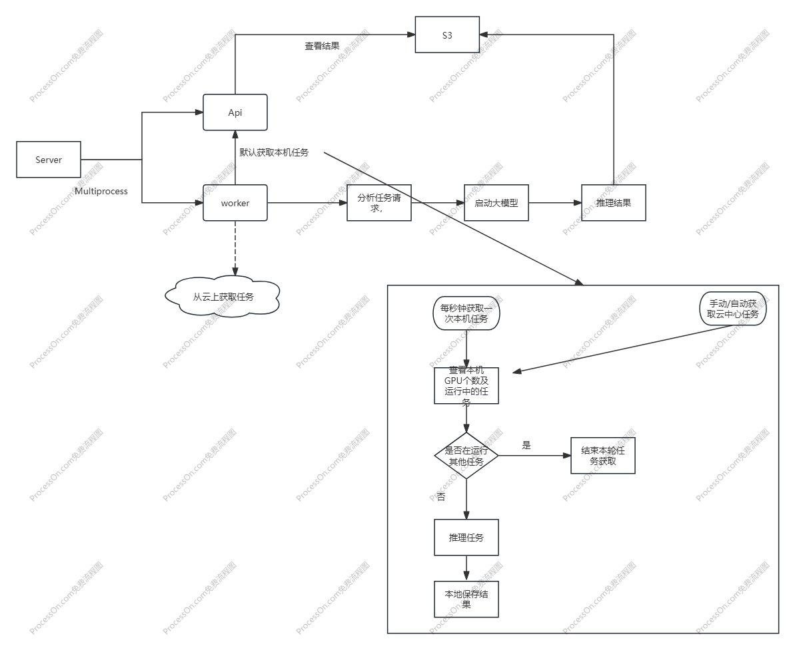

# AI 算力集群服务

## 1. 服务安装部署
```
pip install -r requirements.txt
```

## 2. 服务启动
```
python main.py
```

## 3. 服务架构图


## 4. 源码介绍

- api: api 服务接口目录
  - routes: 路由目录
  - Users：用户相关接口
- cmd: 命令行工具目录
- config: 配置文件目录
- migrations: 数据库迁移目录,使用alembic做为迁移工具
- mixins: 通用工具目录
- schemas: 数据模型目录，使用pydantic做为数据模型
- services: 服务目录
- worker: worker相关功能目录
- utils: tools目录

服务启动流程介绍

1. 服务启动时会自动迁移数据库migrate.新的models需要通过alembic生成迁移文件。
2. 服务启动时时会加载Server，Worker服务。Server服务用于处理api请求，Worker服务用于处理异步任务。Server 通过加载uvicorn启动服务。Worker 通过定时循环调用Server Api 获取任务，执行任务。

## 5. 服务认证
暂未实现

## 6. 大模型运行方式
略

## 7. 大模型调用方式
略